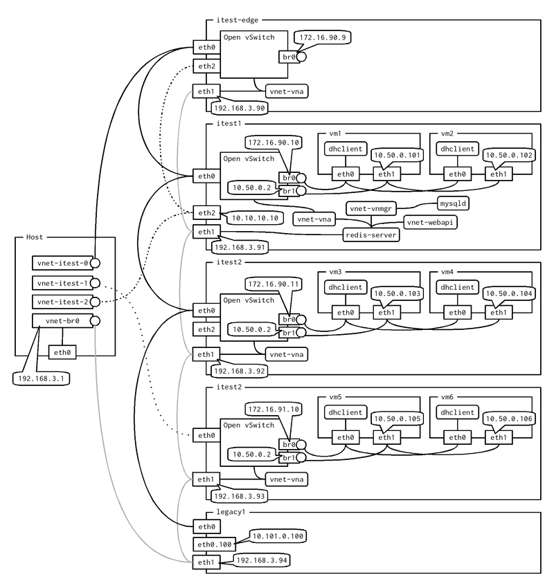

# Development test environment for OpenVNet

## Network Structure



## Build

Simply, type "make".

```
$ git clone https://github.com/wakameci/wakame-ci-cluster.git
$ cd wakame-ci-cluster/kvm-guests/192.168.3.91-vteskins/
$ make
$ ps aux|grep qemu-|grep root
oot      6316  0.5  1.5 2568916 255744 ?      Sl   14:39   0:33 qemu-system-x86_64 -enable-kvm -name kemu90 -cpu qemu64,+vmx -m 256 -smp 1 -vnc 127.0.0.1:11090 -k en-us -rtc base=utc -monitor telnet:127.0.0.1:14090,server,nowait -serial telnet:127.0.0.1:15090,server,nowait -drive file=./box-disk1-head.qcow2,media=disk,boot=on,index=0,cache=none,if=virtio -netdev tap,ifname=kemu90-14090-0,id=hostnet0,script=,downscript= -device virtio-net-pci,netdev=hostnet0,mac=52:54:00:41:06:46,bus=pci.0,addr=0x3 -netdev tap,ifname=kemu90-14090-1,id=hostnet1,script=,downscript= -device virtio-net-pci,netdev=hostnet1,mac=52:54:00:41:06:45,bus=pci.0,addr=0x4 -netdev tap,ifname=kemu90-14090-2,id=hostnet2,script=,downscript= -device virtio-net-pci,netdev=hostnet2,mac=02:01:00:00:00:00,bus=pci.0,addr=0x5 -pidfile kvm.pid -daemonize
root     17701  1.2  2.3 3821152 381268 ?      Sl   14:44   1:08 qemu-system-x86_64 -enable-kvm -name kemu92 -cpu qemu64,+vmx -m 1024 -smp 1 -vnc 127.0.0.1:11092 -k en-us -rtc base=utc -monitor telnet:127.0.0.1:14092,server,nowait -serial telnet:127.0.0.1:15092,server,nowait -drive file=./box-disk1-head.qcow2,media=disk,boot=on,index=0,cache=none,if=virtio -netdev tap,ifname=kemu92-14092-0,id=hostnet0,script=,downscript= -device virtio-net-pci,netdev=hostnet0,mac=52:54:00:42:06:47,bus=pci.0,addr=0x3 -netdev tap,ifname=kemu92-14092-1,id=hostnet1,script=,downscript= -device virtio-net-pci,netdev=hostnet1,mac=52:54:00:42:06:48,bus=pci.0,addr=0x4 -pidfile kvm.pid -daemonize
root     27405  1.3  2.7 5653644 451152 ?      Sl   14:35   1:20 qemu-system-x86_64 -enable-kvm -name kemu91 -cpu qemu64,+vmx -m 1024 -smp 1 -vnc 127.0.0.1:11091 -k en-us -rtc base=utc -monitor telnet:127.0.0.1:14091,server,nowait -serial telnet:127.0.0.1:15091,server,nowait -drive file=./box-disk1-head.qcow2,media=disk,boot=on,index=0,cache=none,if=virtio -netdev tap,ifname=kemu91-14091-0,id=hostnet0,script=,downscript= -device virtio-net-pci,netdev=hostnet0,mac=52:54:00:41:06:47,bus=pci.0,addr=0x3 -netdev tap,ifname=kemu91-14091-1,id=hostnet1,script=,downscript= -device virtio-net-pci,netdev=hostnet1,mac=52:54:00:41:06:48,bus=pci.0,addr=0x4 -netdev tap,ifname=kemu91-14091-2,id=hostnet2,script=,downscript= -device virtio-net-pci,netdev=hostnet2,mac=52:54:00:41:06:49,bus=pci.0,addr=0x5 -pidfile kvm.pid -daemonize
root     29007  1.3  2.3 5192740 378068 ?      Sl   14:50   1:11 qemu-system-x86_64 -enable-kvm -name kemu93 -cpu qemu64,+vmx -m 1024 -smp 1 -vnc 127.0.0.1:11093 -k en-us -rtc base=utc -monitor telnet:127.0.0.1:14093,server,nowait -serial telnet:127.0.0.1:15093,server,nowait -drive file=./box-disk1-head.qcow2,media=disk,boot=on,index=0,cache=none,if=virtio -netdev tap,ifname=kemu93-14093-0,id=hostnet0,script=,downscript= -device virtio-net-pci,netdev=hostnet0,mac=52:54:00:43:06:47,bus=pci.0,addr=0x3 -netdev tap,ifname=kemu93-14093-1,id=hostnet1,script=,downscript= -device virtio-net-pci,netdev=hostnet1,mac=52:54:00:43:06:48,bus=pci.0,addr=0x4 -pidfile kvm.pid -daemonize
root     29327  0.6  0.9 3703776 157100 ?      Sl   14:53   0:32 qemu-system-x86_64 -enable-kvm -name kemu94 -cpu qemu64,+vmx -m 128 -smp 1 -vnc 127.0.0.1:11094 -k en-us -rtc base=utc -monitor telnet:127.0.0.1:14094,server,nowait -serial telnet:127.0.0.1:15094,server,nowait -drive file=./box-disk1-head.qcow2,media=disk,boot=on,index=0,cache=none,if=virtio -netdev tap,ifname=kemu94-14094-0,id=hostnet0,script=,downscript= -device virtio-net-pci,netdev=hostnet0,mac=52:54:00:41:06:43,bus=pci.0,addr=0x3 -netdev tap,ifname=kemu94-14094-1,id=hostnet1,script=,downscript= -device virtio-net-pci,netdev=hostnet1,mac=52:54:00:41:06:42,bus=pci.0,addr=0x4 -pidfile kvm.pid -daemonize
```

## Usage

First, type "make ipmasq_on" to touch internet on KVMs.

```
$ make ipmasq_on
sudo iptables -t nat -A POSTROUTING -s 10.0.1.0/24 -j MASQUERADE
sudo iptables -t nat -L --line
Chain PREROUTING (policy ACCEPT)
num  target     prot opt source               destination

Chain INPUT (policy ACCEPT)
num  target     prot opt source               destination

Chain OUTPUT (policy ACCEPT)
num  target     prot opt source               destination

Chain POSTROUTING (policy ACCEPT)
num  target     prot opt source               destination
1    RETURN     all  --  192.168.122.0/24     base-address.mcast.net/24
2    RETURN     all  --  192.168.122.0/24     255.255.255.255
3    MASQUERADE  tcp  --  192.168.122.0/24    !192.168.122.0/24     masq ports: 1024-65535
4    MASQUERADE  udp  --  192.168.122.0/24    !192.168.122.0/24     masq ports: 1024-65535
5    MASQUERADE  all  --  192.168.122.0/24    !192.168.122.0/24
6    MASQUERADE  all  --  10.0.1.0/24          anywhere
```


Second, run following command on a console.

```
$ telnet localhost 15091
itest1 login: kemukins
Password: kemukins
[kemukins@itest1 ~]$ git clone https://github.com/axsh/openvnet-testspec.git
[kemukins@itest1 ~]$ cd openvnet-testspec
[kemukins@itest1 openvnet-testspec]$ bundle install --without=development
[kemukins@itest1 openvnet-testspec]$ ./bin/dev-spec
```
