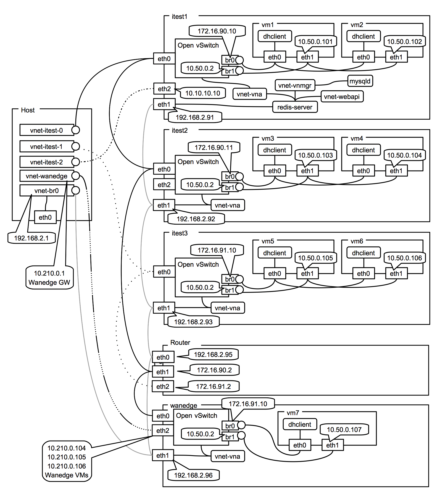

# OpenVNet test environment

## Network Structure



This environment uses nested kvm.

**Terminology**

* The bare metal on which this environment runs is referred to as the `Host`.
* itest-edge, itest1, itest2, itest3, legacy1 and router are referred to as `Layer 1 KVM`
* vm1, vm2, vm3, vm4, vm5 and vm6 are referred to as `Layter 2 KVM` or `nested KVM`

* All networking between machines in *Layer 1 KVM* is referred to as the `physical network`. It might be virtual in reality, but from OpenVNet's point of view it's the physical network. It's the network infrastructure that's *just there* and OpenVNet has no control over. OpenVNet will build virtual networks on top of it.
* All networking between machines in *Layer 2 KVM* is referred to as the `virtual network`. These are the networks that OpenVNet creates and manages.

**Networking related remarks**

* All bridges on the host use the Linux bridge.
* itest-edge, itest1, itest2, and itest3 use Open vSwitch as their bridge.
* itest1 and itest2 are in the same *physical* subnet. OpenVNet will use MAC2MAC between them.
* itest3 is in another *physical* subnet. OpenVNet will use MAC2MAC over GRE tunnels between it and the other machines.
* All the `router` machine does is route packets between the above two subnets.
* The itest-edge and legacy1 machines, represent a non OpenVNet managed physical network being connected to OpenVNet's virtual networks. Legacy1 is the network, itest-edge does the connecting.

## Setup

### Make sure nested KVM is enabled on the host

```
cat /sys/module/kvm_intel/parameters/nested
Y
```

If the following command didn't output **Y**, try this.

```
sudo modprobe -r kvm_intel
sudo modprobe kvm_intel 'options nested=1'
```

To make the above command persist after reboot, add the following line to `/etc/modprobe.d/modprobe.conf`.

```
options kvm_intel nested=1
```

If you're not using an intel processor, the commands will be slightly different. Sorry but you're on your own for that one. I'm sure Google can help. ;)

### Download the boxes

Download the boxes like it says in the top level README. If you haven't already.

This will download 12 GB. Make sure you have room for that on you HD.

```
cd wakame-ci-cluster/boxes
./download-boxes.sh
```

### Build and run all VMs

```
cd wakame-ci-cluster/kvm-guests/90-vteskins/
./build_and_run_all.sh
```

### Run without rebuilding

Have you already built the VMs and just want to run them without rebuilding from scratch? Here's how you do it.

```
cd wakame-ci-cluster/kvm-guests/90-vteskins/
./init_bridges.sh
./run.sh
cd ../91-vteskins/
./run.sh
cd ../92-vteskins/
./run.sh
cd ../93-vteskins/
./run.sh
cd ../94-vteskins/
./run.sh
cd ../95-vteskins/
./run.sh
```

## Running the integration test

The following commands need to be executed on the host. This guide will use [rvm](https://rvm.io) to set up Ruby. Refer to their guides to get rvm installed on your system.

We are going to use Ruby 2.2.0 for this test. Install it.

```
rvm install 2.2.0
```

Now get the integration test from Github.

```
git clone https://github.com/axsh/openvnet-testspec
```

Use Ruby 2.2.0 to install the integration test's dependencies.

```
rvm use 2.2.0
gem install bundler
cd openvnet-testspec
bundle install
```

First run the simple test to make sure that everything's working.

```
bin/itest-spec run simple
```

If this ran alright, run all tests.

```
bin/itest-spec run
```
